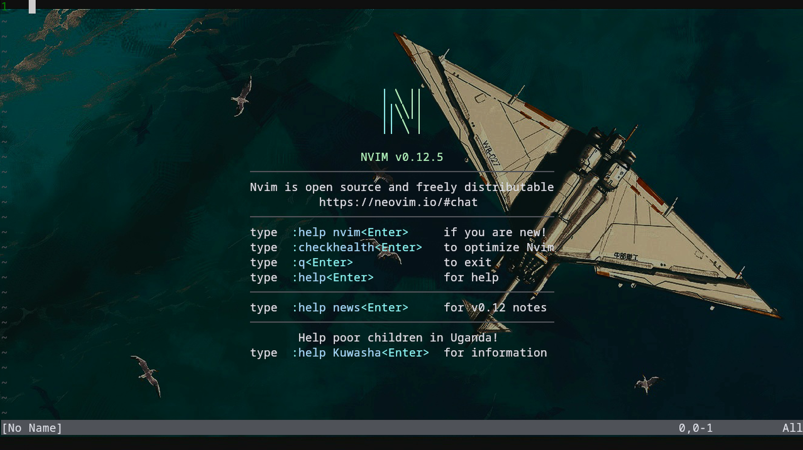
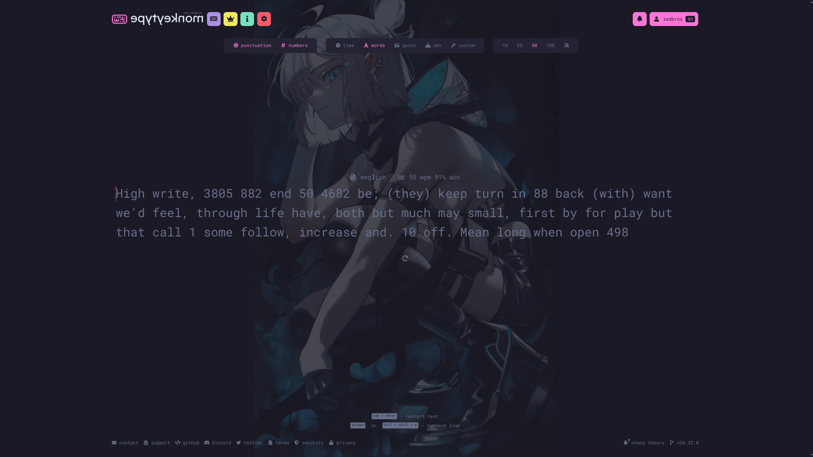

# Hello, this is my personal useful file dump
I use Arch Linux KDE Plasma and like customizing the hell out of it, especially the keybindings.
# Configs
## Terminal
I use ZSH.
#### kitty.conf
    Kitty terminal config (stored in .config/kitty/):
    - background image
    - cool cursor effects
    - no annoying audio when you hit a tab wall for example
    - remote control to change wallpaper when switching between neovim and the terminal (see both scripts in Scripts/Shell/kitty-bg.sh and Scripts/Shell/nvim-bg.sh)
    - scrollback pager means I can open the terminal history in neovim, if I want to look for a specific term for example
    - tilling windows (current or root directory) and basic windows cycle
    - kitty tabs
    - background switcher

## Text editor
### Neovim
    Neovim entire config folder (stored in .config/)
    nvim
    │   init.lua
    │   lazy-lock.json
    └───lua
        └───config
        │       lazy.lua
        └───plugins
                mini-icons.lua
                telescope.lua
                which-key.lua
                deactivated
                └───neoscroll.lua

    - customizations in init.lua (detailed comments)
    - plugins found in nvim/plugins
    - deactivated plugins found in nvim/plugins/deactivated. These are plugins that could be useful but require some tweaking (problem for a future self)

## VS Code
    My shortcuts (yes tab is go to end of line not suggestions or tab (to actually tab: Ctrl+Tab)).\
    To be stored in .config/Code/User/

## Arch System Settings
    My arch system settings shortcuts for the general navigation and opening apps.\
    To be imported from settings -> Keyboard -> Shortcuts -> top right of the screen.

## Monkeytype
    A website to train and test you typing speed.

## Kruker
    The webgame krunker.io personal settings.

 
 
 
 
 
 

# Scripts
## Bash
#### logs-perms-script.sh: 
    A bash script that I used to parse log files by retrieving the unique permissions attached to their source that were used.
#### filter-time-logs-script.sh
    A bash script that does the same as logs-perms-script.sh but you can choose at what time you want the logs to start. (removed previous logs used for console access for example, instead of the acutal action I wanted to record)

## Shell
#### nvim-bg
    Is called when entering neovim in kitty terminal. This changes the background to the one you can see above.
#### kitty-bg
    Is called when exiting neovim. This changes the background back to the default background you can see above.\
    note: changing the background in kitty.conf, will not change the default background when exiting neovim
#### geet
    Much faster git commands in one: git add . | git status | yes/or/no => git commit --allow-empty --allow--empty-messages -m "commit_message" | git push

#### updt (deactivated)
    Is a project that will update the chosen scripts and configs on my machine. Like a git pull/push but between my local repo and (my local config files, .local/bin/ scripts and other various scripts (ftls for ex.) ).
